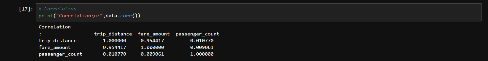
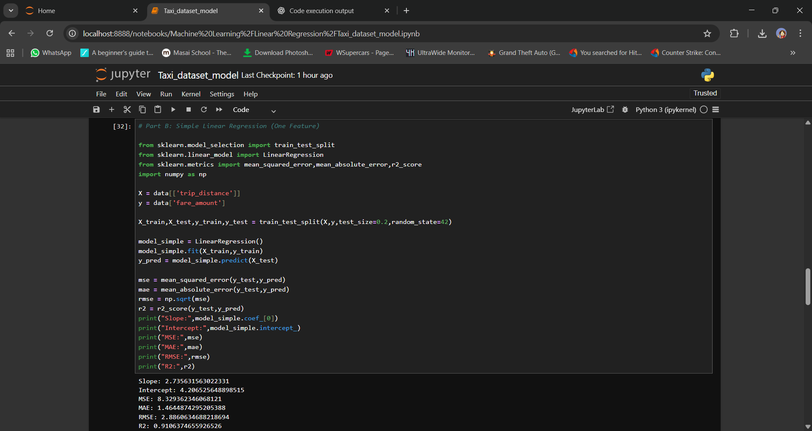
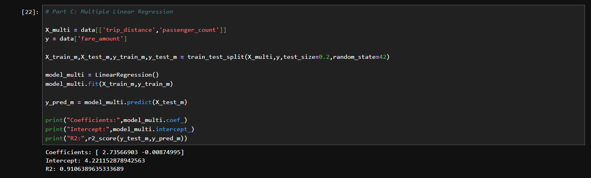
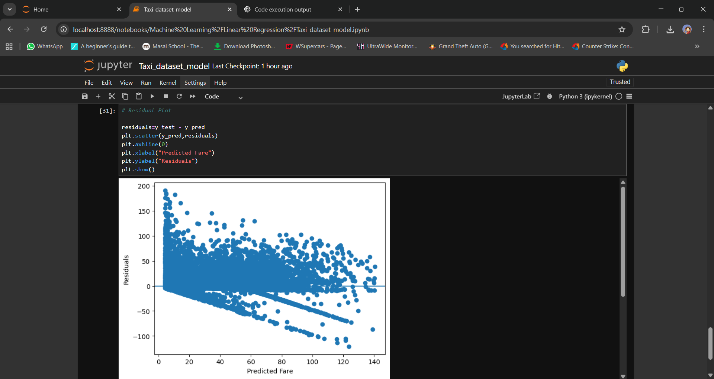

NYC Yellow Taxi Fare Prediction using Linear Regression

This project analyzes real-world NYC Yellow Taxi Trip Data to
understand how trip distance and passenger count affect taxi fares.

Tech Stack:
- Python
- Pandas
- NumPy
- Scikit-learn
- Matplotlib

Key Results:
- Correlation between trip distance and fare ≈ 0.95
- Simple Linear Regression R² ≈ 0.91
- Trip distance is the strongest predictor of fare

Use Cases:
- Fare estimation
- Transportation analytics
- Data science learning project

## 📊 Project Screenshots

### 🔹 Correlation Analysis

### 🔹 Simple Linear Regression Output

### 🔹 Multiple Linear Regression Output

### 🔹 Visualization & Residual Plots

